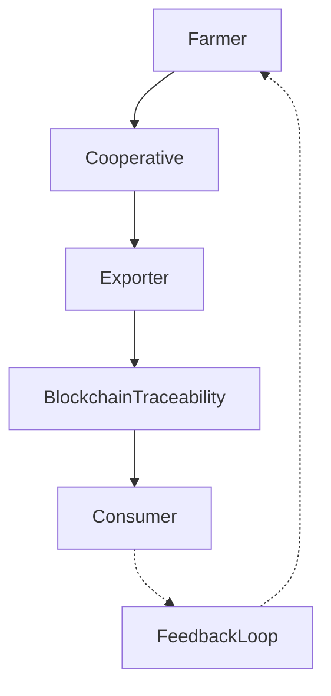

# 🌱 AgroViz

## 📌 About

AgroViz adalah platform supply chain berbasis blockchain untuk produk pertanian. Sistem ini melacak perjalanan komoditas (misalnya kopi, beras, atau hasil bumi lain) mulai dari petani, koperasi, hingga eksportir dan konsumen. Semua data transparan, immutable, dan dapat diverifikasi.

---

## 🎯 Vision Statement

Mewujudkan rantai pasok pertanian yang transparan, adil, dan terpercaya, dengan memberdayakan petani sekaligus memberi keyakinan kepada konsumen global mengenai asal-usul produk yang mereka konsumsi.

---

⚙️ Fitur Utama (MVP)

✅ Registrasi produk pertanian dengan metadata (nama, asal, hash IPFS).

✅ Transfer kepemilikan produk dari petani → koperasi → eksportir → buyer.

✅ Pelacakan rantai pasok secara on-chain.

---

## 🛠️ Tech Stack

- Solidity (Smart Contract)

- Ethereum Sepolia Testnet

- Streamlit (Dashboard Visualisasi)

- IPFS untuk metadata sertifikat & dokumentasi produk

---

## 🧰 Workflow

---

## 🚀 Quickstart

1. Clone repo

2. Deploy kontrak AgroViz.sol ke Sepolia

3. Tambahkan data produk (contoh: kopi arabika Aceh).

4. Transfer kepemilikan produk antar pihak di supply chain.

5. Visualisasi rantai pasok di dashboard AgroViz.

---

## 📜 License
MIT © 2025 RANTAI / ELPEEF
